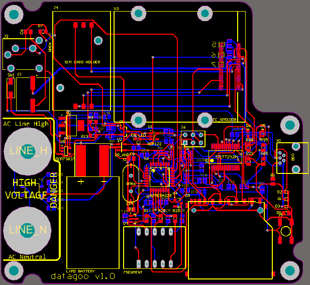
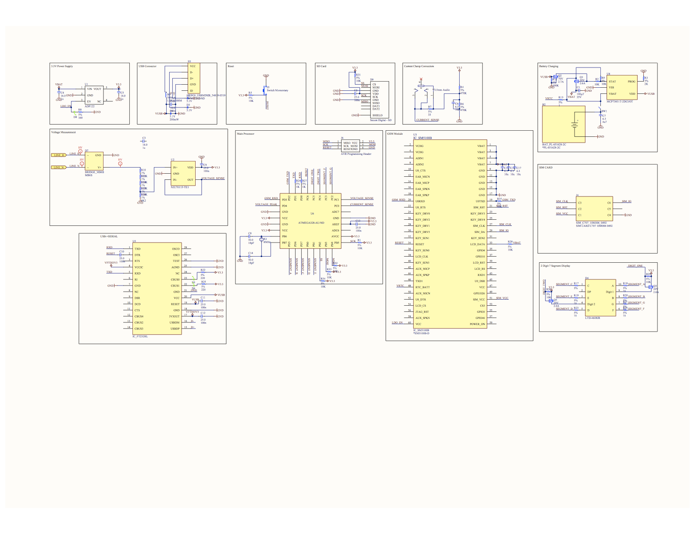
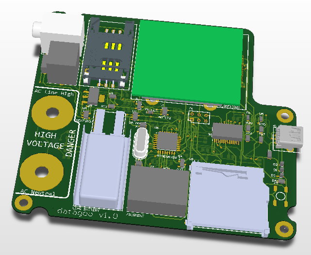

.. _ref-electrical:

==========
Electrical
==========

.. warning::

   Before trying to have the PCB manufactured, please contact
   nhallsny@stanford.edu for the correct settings. For components and
   designators, check out the Bill of Materials

..Two Layer-Board 

Schematic
=========

.. note:: 

   See below for known bugs before using these designs.

..
:download:`Download Electrical Schematic <images/electrical_schematic.pdf>`.

Electrical Schematics (generated in Altium):

Design Errors
=============
1. If the device is completely discharged, and is recharged with a USB charger, the reset button needs to be pressed in order to reset the device.
2. The voltage measurement is not isolated. While we made this decision for cost reasons, for safety and ease of hacking the design should be updated with an isolation transformer.

Schematic Errors
================
   There are no known errors in the below schematic.

Layout Errors
=============

There are several known errors in the layout:

1. The LDO_EN is not connected from the GSM Module
2. The GSM_TXD is not connected to the GSM Module
3. The MOSI pin on the AVR programming header is RST, and should be MOSI
4. The Zener diode footprint does not have a direction indicator
5. The LED footprint does not have a clear direction indicator
6. The footprint for SW1 is incorrect, but hackable
7. The large 100uF capacitor doesn't have a polarity marking
8. The same net is connected to two of the seven segment display pins
9. The pullup for the reset net is not connected to 3.3V

3D Layout
=========

   The 3D render of the electrical layout:

