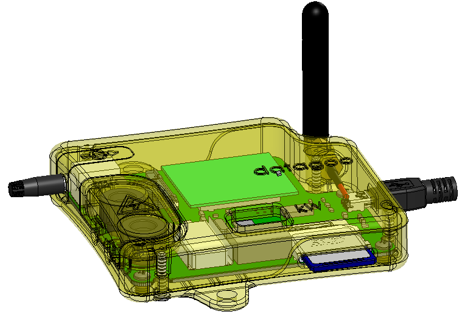

.. DataGoo documentation master file, created by
   sphinx-quickstart on Sun Mar  4 19:27:08 2012.
   You can adapt this file completely to your liking, but it should at least
   contain the root `toctree` directive.

Datagoo Documentation
=====================

Contents:

.. toctree::
   :maxdepth: 1

   quickstart
   overview
   ac_math
   systems_design
   components
   cost
   electrical
   mechanical
   software

Project Description
===================
DataGoo is an open-source device designed to measure power generation
or consumption from small-scale electrical installations--cheaply. We
designed it to be initially deployed in `microhydro plants
<http://www.alterna-la.org/en/projects/microhydro>`_ run by `Alterna
<http://www.alterna-la.org/en>`_ in Guatemala.

DataGoo builds heavily on a similar, open-source device called the
`OpenEnergyMonitor <http://www.openenergymonitor.org>`_ (emon). The emon system
involves a transmitting device, a receiving device, and
display software and is targeted for in-home deployment. Our device is
designed for deployment in the field, so it uses a simpler output
interface: text messages over GSM and logging to an SD card.

Indices and tables
==================

.. * :ref:`genindex`
.. * :ref:`search`
