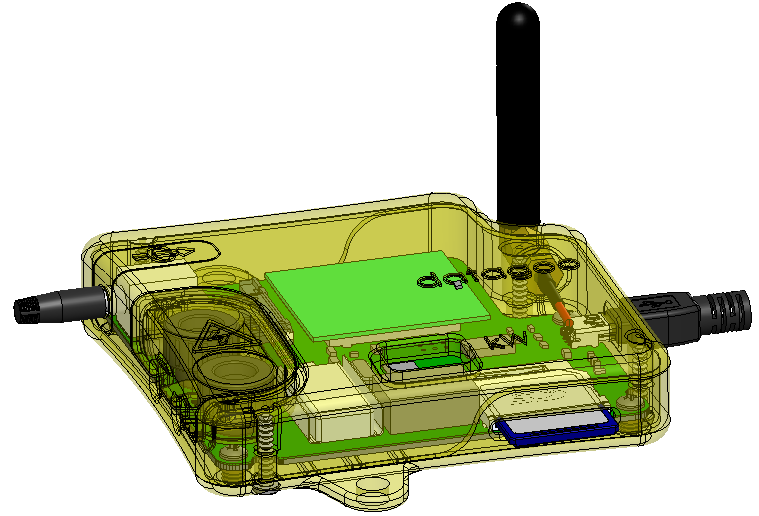

.. _ref-mechanical:

==========
Mechanical
==========

3D Printing the Datagoo Case
============================

The files below can be sent to any 3D printing company for
fabrication. I would suggest Shapeways, for price. Our first prototype
was completed by ZoomRP. Use these links to order your own copy:

| **Shapeways Permalinks**
| Upper Case: http://shpws.me/4lcv $33.74
| Lower Case: http://shpws.me/4lcx $37.51
| Cover: http://shpws.me/4ldY $6.22

The three files that constitute the case are the Cover, the Lower Body
and the Upper Body. The .stl (stereolithography) file is used by most
common 3d printing companies.

If there are needed changes to the solid files, the original
Solidworks files still exist. Please email nhallsny@stanford.edu with
any requests.

Known Errors
============

No known errors.
