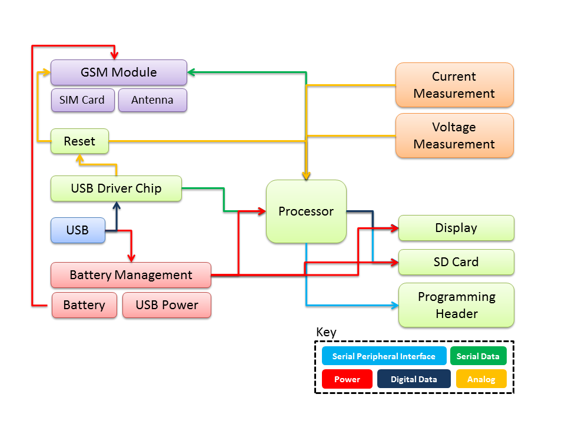
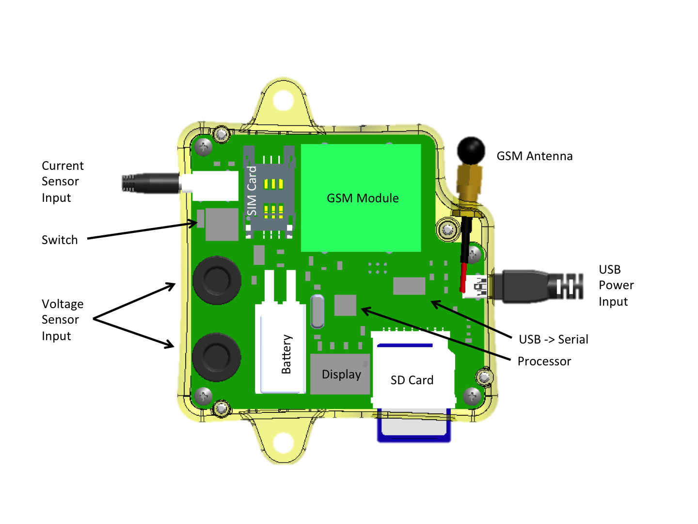

.. _ref-systems_design:

==============
Systems Design
==============

Electrical Block Diagram
========================

Datagoo is built around the ATMEGA328P, the same processor used by many hobbyists for a variety of `Arduino <http://www.arduino.cc/>`_ designs. When coupled with an FTDI FT232RL USB-Serial circuit, the board can be programmed with any computer with a USB port. Other design decisions were made in the interest of cost and simplicty. Surface mount components were chosen for ease of manufacturing. The voltage and current measurement circuits were designed to utilize the ATMEGA328P's internal Analog-to-Digital converters, again reducing the component cost. The cell phone module was chosen for price - it is one of the cheapest GSM modules available. Also, all the components for which critical software needed to be written are avaiable in Arduino shield form, making testing custom applications more accessible.

Component Descriptions
========================

